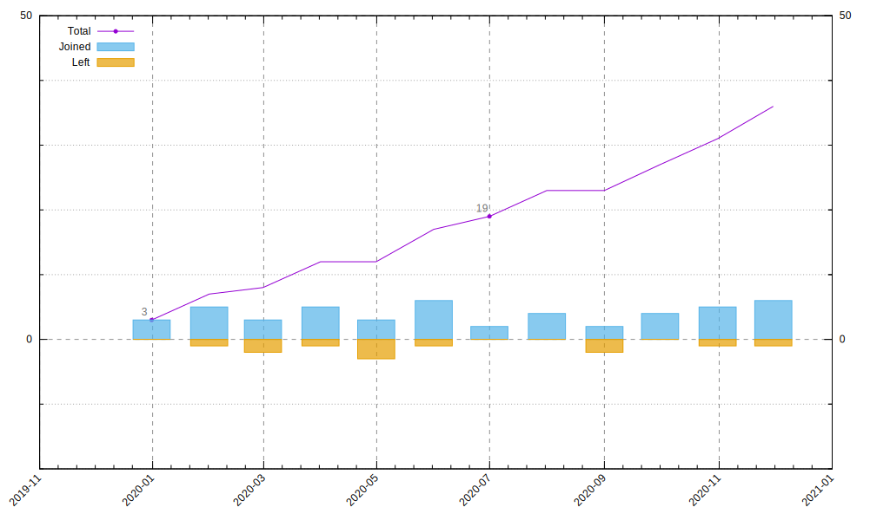
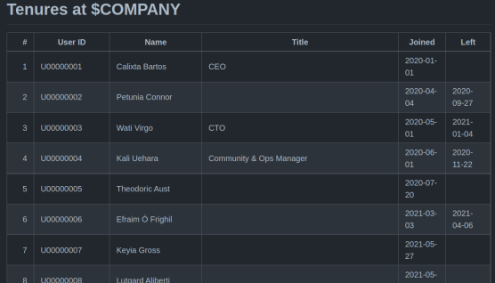
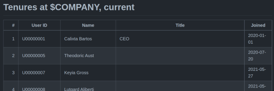
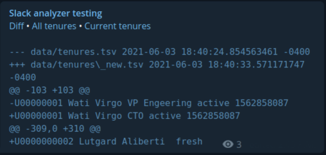
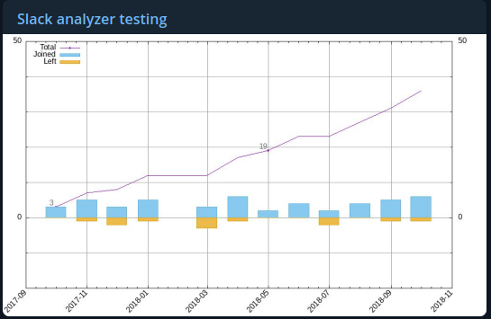

# Slack analyzer

[](https://github.com/bewuethr/slack-analyzer/actions/workflows/linter.yml)
[](https://github.com/bewuethr/slack-analyzer/actions/workflows/releasetracker.yml)

Slack analyzer is a GitHub Action to fetch all users from a Slack workspace and
determine when they joined and potentially left the workspace. This is used as
a proxy for tenure with a company.

The result is a README file with a graph showing turnover month over month, and
three Markdown tables showing when the current employees joined, the tenures of
all employees ever by join date, and all tenures by duration. The README links
to all relevant files.



| Example for all tenures             | Example for current tenures                         |
| ----------------------------------- |---------------------------------------------------- |
|  |  |

Optionally, the action output can be used to send the latest diff and the graph
to a Telegram channel, using a separate action.

| Example Telegram diff message          | Example Telegram graph message           |
| -------------------------------------- | ---------------------------------------- |
|  |  |

## Inputs

### `name`

**Required** The name of the workspace/company to be used in the output file
headings.

### `slack-bot-token`

**Required** A Slack API bot token with the `users:read` scope for the
workspace; this is required to fetch the list of users from the workspace.

### `slack-user-token`

**Required** A Slack API user token with the `search:read` scope for the
workspace; this is required to fetch the first and last message of a user.

## Outputs

### `diff-msg`

The latest diff in tenures, formatted for Telegram and JSON-escaped. Use
`fromJSON` to unescape. If there was no diff, the string is empty; this should
be checked before trying to use the diff.

### `graph-path`

The path to the PNG version of the turnover graph for usage in a Telegram
message (which does not support SVG). If no new graph was generated, the string
is empty; this should be checked before trying to use the graph in a message.

## Example usage

This includes the optional Telegram notifications.

```yaml
name: Update tenures and graph

on:
  # Manual trigger
  workflow_dispatch:

  # Every day at 11:00 and 22:00 UTC
  schedule:
    - cron: 0 11,22 * * *

env:
  # Optionally set timezone
  TZ: America/Toronto

jobs:
  update:
    name: Update tenures and graph
    runs-on: ubuntu-20.04

  steps:
    - name: Check out repository
      uses: actions/checkout@v2

    - name: Update Slack workspace analysis
      id: update
      uses: bewuethr/slack-analyzer@v0
      with:
        name: Foo Corp
        slack-bot-token: ${{ secrets.BOT_TOKEN }}
        slack-user-token: ${{ secrets.USER_TOKEN }}

    - name: Send Telegram message for change
      # Don't send message if there is no diff
      if: steps.update.outputs.diff-msg != ''
      uses: appleboy/telegram-action@v0.1.1
      with:
        to: ${{ secrets.TELEGRAM_TO }}
        token: ${{ secrets.TELEGRAM_TOKEN }}
        format: markdown
        message: ${{ fromJSON(steps.update.outputs.diff-msg) }}

    - name: Send Telegram message for graph
      # Don't send graph if it was not generated
      if: steps.update.outputs.graph-path != ''
      uses: appleboy/telegram-action@v0.1.1
      with:
        to: ${{ secrets.TELEGRAM_TO }}
        token: ${{ secrets.TELEGRAM_TOKEN }}
        photo: ${{ steps.update.outputs.graph-path }}
        # Required to avoid sending separate extra message
        message: ' '
```

For details about using Telegram, see [Use a GitHub action to send Telegram
messages][1].

[1]: <docs/telegram.md>

## Assumptions

- An employee is assumed to have joined the company at the date of their first
  public Slack message
- They are assumed to have left the company at the date of their last public
  Slack message
- If somebody joins and leaves without ever posting a public message, they
  don't show up in the final table
- Employee numbers are assigned in ascending order of the timestamp of the
  first message; this isn't necessarily the true order, especially not for
  employees who joined before the company started using Slack &ndash; see
  `corrections.csv` below for a fix

## Slack API calls

- Get all users: [`users.list`][2]
- Find first/last message of a user: [`search.messages`][3], queried with
  `from:<@USERID>`; this means that the result depends on the user who owns the
  `USER_TOKEN` and which private channels they have access to

Calls to `search.messages` retry once on error; because curl respects the
`Retry-After` header, this slows down requests just enough when hitting the
rate limit.

[2]: <https://api.slack.com/methods/users.list>
[3]: <https://api.slack.com/methods/search.messages>

## Generated files

- `README.md` contains the turnover graph and links to the other Markdown files
  and data sources
- `data/tenures.tsv` contains the tab-separated data for all users with Slack
  ID, name, title, status, and Unix timestamp of first and last message, where
  applicable; status can be one of
  - `active`: user is still active member of the workspace
  - `alum`: user is marked `deleted` and has a timestamp for their last message
  - `fresh`: user is active member of the workspace, but hasn't posted yet
  - `noshow`: user is marked `deleted` and never posted a message
- `data/corrections.csv` is an optional file containing corrections for known
  incorrect values; it uses four comma-separated columns:

  | Heading  | Meaning                                            |
  | -------- | -------------------------------------------------- |
  | `id`     | the ID of the user to which the correction applies |
  | `delete` | set to `true` if the user should be removed        |
  | `first`  | Unix timestamp for join date                       |
  | `last`   | Unix timestamp for departure date                  |

  See [Manually correcting data from Slack][4] for more details.

- `tenures.md` is the Markdown-formatted view of the `data/tenures.tsv` with
  no-shows removed, and human-readable datestamps, ordered by date of the first
  message
- `tenurescurrent.md` is the Markdown-formatted view of `tenures.tsv` with only
  current employees
- `tenuresduration.md` is like `tenures.md`, but ordered by duration instead of
  join date
- The `diffs/YYYY/MM/*.diff` files contain the unified diffs of the TSV data
  between two updates, grouped in year and month subdirectories
- `data/turnover.tsv` is generated from `tenures.tsv` to be used as input for
  the script that generates the turnover graph; it is committed so it can serve
  as an indicator if the graph should be regenerated or not
- `turnover.svg` is the graph used in `README.md`

For more details about the implementation, see [Implementation notes][5].

[4]: <docs/corrections.md>
[5]: <docs/implementation.md>
